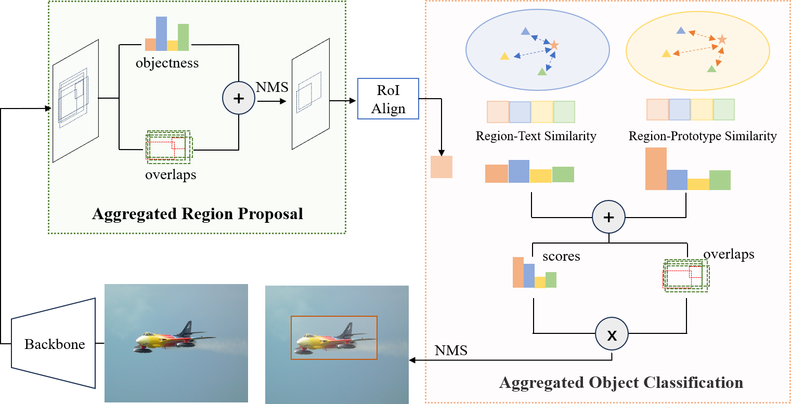

# AggDet
This repo is the implementation of [Training-free Boost for Open-Vocabulary Object Detection with Confidence Aggregation]()

## Abstract
Open-vocabulary object detection (OVOD) aims at localizing and recognizing visual objects from novel classes unseen at the training time.
Whereas, empirical studies reveal that advanced detectors generally assign lower scores to those novel instances, which are inadvertently suppressed during inference by commonly adopted greedy strategies like Non-Maximum Suppression (NMS), leading to sub-optimal detection performance for novel classes. 
This paper systematically investigates this problem with the commonly-adopted two-stage OVOD paradigm.
Specifically, in the region-proposal stage, proposals that contain novel instances showcase lower objectness scores, since they are treated as background proposals during the training phase.
Meanwhile, in the object-classification stage, novel objects share lower region-text similarities (i.e., classification scores) due to the biased visual-language alignment by seen training samples.
To alleviate this problem, this paper introduces two advanced measures to adjust confidence scores and conserve erroneously dismissed objects: (1) a class-agnostic localization quality estimate via overlap degree of region/object proposals, and (2) a text-guided visual similarity estimate with proxy prototypes for novel classes.
Integrated with adjusting techniques specifically designed for the region-proposal and object-classification stages, this paper derives the aggregated confidence estimate for the open-vocabulary object detection paradigm AggDet.



## Preparations
- Installation

    Following the [Installation instructions](https://github.com/CVMI-Lab/CoDet/blob/main/README.md#installation) of [CoDet](https://github.com/CVMI-Lab/CoDet) to setup environment.

- Datasets

    Following the [Prepare Datasets](https://github.com/CVMI-Lab/CoDet?tab=readme-ov-file#prepare-datasets) of [CoDet](https://github.com/CVMI-Lab/CoDet) to prepare the COCO and LVIS datasets.

    After the preparation is complete, your directories should be organized as follows:
    ```
    datasets/
    ├── coco
    │   ├── annotations
    │   ├── train2017
    │   ├── val2017
    │   └── zero-shot
    ├── lvis
    │   ├── lvis_v1_train.json
    │   ├── lvis_v1_train_norare_cat_info.json
    │   ├── lvis_v1_train_norare.json
    │   └── lvis_v1_val.json
    ├── metadata
    │   ├── coco_categories_info.json
    │   ├── codet_cc3m_clip_a+cname.npy
    │   ├── codet_cococap_clip_a+cname.npy
    │   ├── codet_coco_clip_a+cname.npy
    │   ├── codet_lvis_v1_clip_a+cname.npy
    │   ├── codet_o365_clip_a+cnamefix.npy
    │   ├── detic_coco_clip_a+cname.npy
    │   ├── detic_lvis_v1_clip_a+cname.npy
    │   ├── lvis_categories_info.json
    │   └── lvis_v1_train_cat_info.json
    └── prototypes
        ├── CoDet_COCO_RN50.npy
        ├── CoDet_LVIS_EVA02.npy
        ├── CoDet_LVIS_RN50.npy
        ├── CoDet_LVIS_SWINB.npy
        ├── Detic_COCO_RN50.npy
        └── Detic_LVIS_SWINB.npy
    ```
    where the prototypes directory contains pre-extracted visual prototypes, and you can use [`extract_training_set_features.py`](./extract_training_set_features.py) to generate them.
    ```shell
    ### For Detic with a ResNet50 backbone on the OV-COCO dataset.
    python extract_training_set_features.py --dataset coco --detection-weight datasets/metadata/detic_coco_clip_a+cname.npy --config-file config/Detic_RN50_COCO.py
    ```

- Pretrained weights
  You can download the pre-trained weights from the official github repos of [Detic](https://github.com/facebookresearch/Detic/blob/main/docs/MODEL_ZOO.md) and [CoDet](https://github.com/CVMI-Lab/CoDet?tab=readme-ov-file#model-zoo).

## Inference
Take Detic with a ResNet50 backbone on the OV-COCO dataset as an example.
```shell
python train_net.py --eval-only --config-file configs/Detic_RN50_COCO.yaml
```

You can modify the fllowing parameters in the [yaml file](./configs/Detic_RN50_COCO.yaml#L456) to adjust the parameters described in the paper.
```yaml
OVERLAP_TOPK: 3
ALPHA: 0.05
BETA: 0.75
```
For example, use the following command to test the baseline model:
```shell
python train_net.py --eval-only --config-file configs/Detic_RN50_COCO.yaml  \
MODEL.OVERLAP_TOPK=0 MODEL.ALPHA 0.0 MODEL.BETA 0.0
```

You can change the `config-file` to change the model and dataset.

## Citation
```
@article{
  title={Training-free Boost for Open-Vocabulary Object Detection with Confidence Aggregation},
  author={Yanhao Zheng, Kai Liu},
  journal={arXiv preprint arXiv:xxxx.xxxx},
  year={2024}
}
```

## Acknowledgment
AggDet is built upon the awesome works [Codet](https://github.com/CVMI-Lab/CoDet), [EVA](https://github.com/baaivision/EVA/tree/master) and [Detic](https://github.com/facebookresearch/Detic). Many thanks for their wonderful works. 
